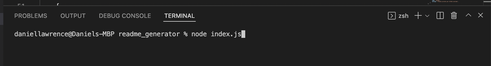
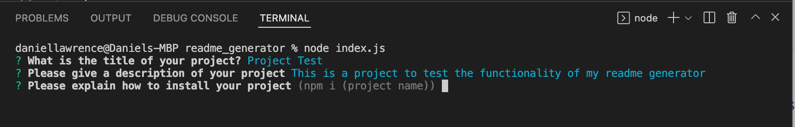
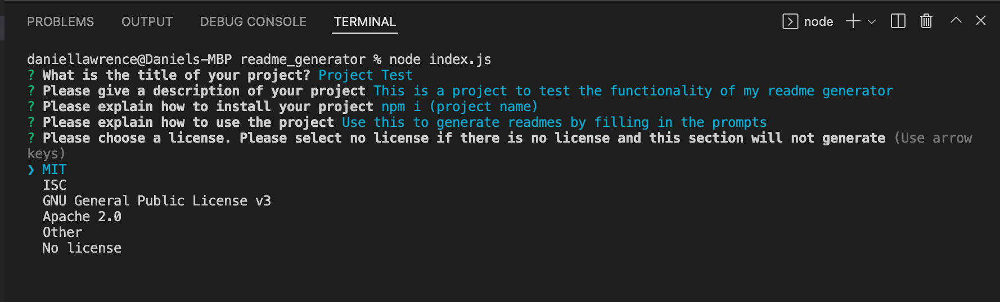
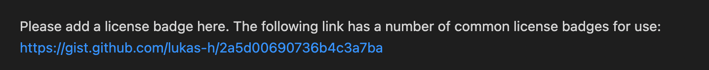
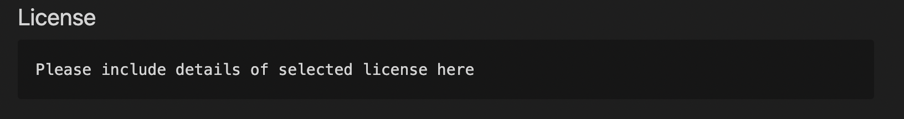

# Readme Generator

  ## Description
  This project is to create an app that produces a high quality readme file in markdown format to be used in future projects. The readme generated will have a working table of contents with links to each section, instructions on installation and usage as well as information on how to contribute and if any tests need to be run. There will be a section explaining what to do with question, with contacts links for the creator via email and GitHub. The readme generator will also give you the option to choose from some of the more common license choices for your project, or you can select other to add in a different one, with help on how to find the badge for the one you need. 
  
  ## Usage
  This project is to be used to save time when setting up a readme at the start of your project. It can be called from the command line and once it has been called there are a series of questions to be answered. Once these questions have been answered a readme file in markdown format will be generated with the name following standard convention - README.md.

  The following screenshots will help with showing how to use the command line application.

  This image shows how the application is loaded from the terminal by typing in:
   
    ``node index.js``

  

  If a default option is shown next to a prompt like in the image below this can be selected by pressing 'Enter'

  

  Different licenses can be selected by pressing the arrow keys up or down to move around the list and selecting chosen option by pressing 'Enter'

  

  If the 'Other' option is chosen from the license list the below images shows what is added to the readme to show the user where to put the required information and where the image/link for the badge can be found.

  

  

  ## Walkthrough Video

  Please click this [link](https://drive.google.com/file/d/1GzFRHNZl-tjPopkntYGomlWlq3OXGMYm/view?usp=sharing) to watch the walkthrough video for this application.
  Please note that the readme generated from this video has had its name changed to sampleREADME.md so as not to have the same name as this file as the readme's created from the generator all have the name README.md. This can be seen in the video and the name was changed afterwards so as to avoid confusion. Please use sampleREADME.md to see the functionality from the readme generator as that is what was created using the app and is the readme from the video submitted

